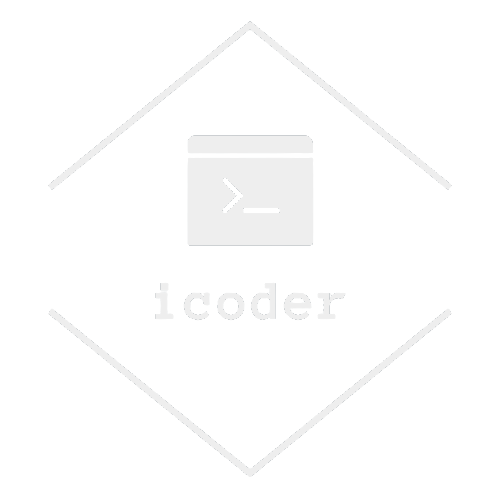

<a name="readme-top"></a>
<br />
<div align="center">
  <a href="https://github.com/RanitManik/Bootsrap.git">
    
  </a>

<h1 align="center">iCoder</h1>

<h3> Welcome to iCoder - Your Ultimate Coding Blogging Site
</h3>

<br />
<a href="https://ranitmanik.github.io/iCoder-Bootsrap/"><strong>Visit the Website »</strong></a>
<br />
<br />
<a href="https://ranitmanik.github.io/iCoder-Bootsrap/">View Demo</a>
·
<a href=".github/ISSUE/bug-report---.md">Report Bug</a>
·
<a href=".github/ISSUE/feature-request---.md">Request Feature</a>

  </p>
</div>

<!-- TABLE OF CONTENTS -->
<details>
  <summary>Table of Contents</summary>
  <ol>
    <li>
      <a href="#about-the-project">About The Project</a>
      <ul>
        <li><a href="#built-with">Built With</a></li>
      </ul>
    </li>
    <li>
      <a href="#getting-started">Getting Started</a>
      <ul>
        <li><a href="#prerequisites">Prerequisites</a></li>
        <li><a href="#installation">Installation</a></li>
      </ul>
    </li>
    <li><a href="#usage">Usage</a></li>
    <li><a href="#roadmap">Roadmap</a></li>
    <li><a href="#contributing">Contributing</a></li>
    <li><a href="#license">License</a></li>
    <li><a href="#contact">Contact</a></li>
    <li><a href="#acknowledgments">Acknowledgments</a></li>
  </ol>
</details>

<!-- ABOUT THE PROJECT -->

# About The Project

[![Product Name Screen Shot][product-screenshot]](https://github.com/RanitManik/iCoder-Bootsrap)
iCoder is a cutting-edge blogging platform designed for coding enthusiasts like you! Powered by Bootstrap, our sleek and modern interface provides an immersive reading experience for all things coding-related.
  visit my website : https://ranitmanik.github.io/iCoder-Bootsrap/

<p align="right">(<a href="#readme-top">back to top</a>)</p>

## Built With

[![Bootstrap][Bootstrap.com]][Bootstrap-url]

<p align="right">(<a href="#readme-top">back to top</a>)</p>

<!-- GETTING STARTED -->

# Getting Started

This is an example of how you may give instructions on setting up your project locally.
To get a local copy up and running follow these simple example steps.

### Prerequisites

This is an example of how to list things you need to use the software and how to install them.

- npm
 
  ```sh
  npm install npm@latest -g
  ```

### Installation

1. clone this repo
   ```sh
   git clone https://github.com/RanitManik/Bootsrap.git
   ```

2. Install NPM packages
   ```sh
   npm install
   ```

<p align="right">(<a href="#readme-top">back to top</a>)</p>

<!-- USAGE EXAMPLES -->

# Outcome

Welcome to my Bootstrap website project for coding beginners! In this project, I will take you through the fundamental concepts of Bootstrap and show you how to create a responsive and visually appealing website using this popular front-end framework. Whether you are new to coding or an experienced developer looking to streamline your design process, Bootstrap is an excellent tool to have in your toolkit. Let's dive right in!

_For more , please read guide to bootstrap [Guide](.github/ISSUE/guide---.md)_

<p align="right">(<a href="#readme-top">back to top</a>)</p>

<!-- ROADMAP -->

# Roadmap

- [ ] Feature 1
- [ ] Feature 2
- [ ] Feature 3
  - [ ] Nested Feature


 [open issues](.github/ISSUE/bug-report---.md) for a full list of and known issues.
 
 [open features](.github/ISSUE/bug-report---.md) to propose a feature.
<p align="right">(<a href="#readme-top">back to top</a>)</p>

<!-- CONTRIBUTING -->

# Contributing

Contributions are what make the open source community such an amazing place to learn, inspire, and create. Any contributions you make are **greatly appreciated**.

If you have a suggestion that would make this better, please fork the repo and create a pull request. You can also simply open an issue with the tag "enhancement".
Don't forget to give the project a star! Thanks again!

1. Fork the Project
2. Create your Feature Branch (`git checkout -b feature/AmazingFeature`)
3. Commit your Changes (`git commit -m 'Add some AmazingFeature'`)
4. Push to the Branch (`git push origin feature/AmazingFeature`)
5. Open a Pull Request

<p align="right">(<a href="#readme-top">back to top</a>)</p>

<!-- LICENSE -->

# License

Distributed under the MIT License. See `LICENSE.txt` for more information.

<p align="right">(<a href="#readme-top">back to top</a>)</p>

<!-- CONTACT -->

# Contact

Your Name - Ranit Kumar Manik - ranitmanikofficial@outlook.com

Project Link: [https://github.com/RanitManik/Bootsrap.git](https://ranitmanik.github.io/iCoder-Bootsrap/)

<p align="right">(<a href="#readme-top">back to top</a>)</p>

<!-- ACKNOWLEDGMENTS -->

# Acknowledgments

- I would like to acknowledge that I didn't create this website alone. It was inspired by a fantastic YouTube tutorial, which you can <a href="https://youtu.be/vpAJ0s5S2t0"><strong> watch here »</strong></a>

- Feel free to check it out and see the source of inspiration for this project.

- Thank you for visiting Planet-Earth, and we hope you enjoy exploring the wonders of our beautiful planet!
<p align="right">(<a href="#readme-top">back to top</a>)</p>

<!-- MARKDOWN LINKS & IMAGES -->
<!-- https://www.markdownguide.org/basic-syntax/#reference-style-links -->

[Bootstrap.com]: https://img.shields.io/badge/Bootstrap-563D7C?style=for-the-badge&logo=bootstrap&logoColor=white
[Bootstrap-url]: https://getbootstrap.com
[product-screenshot]: images/screenshot.png


